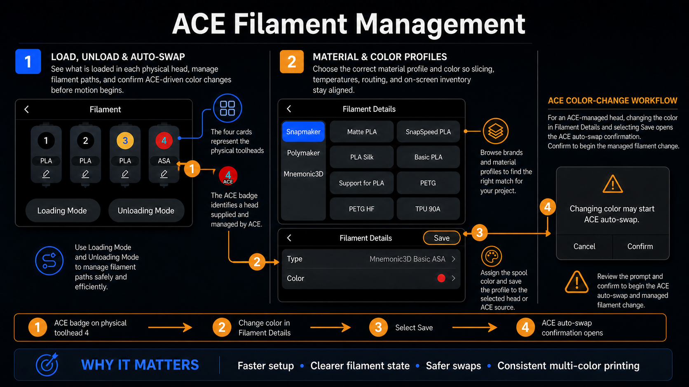
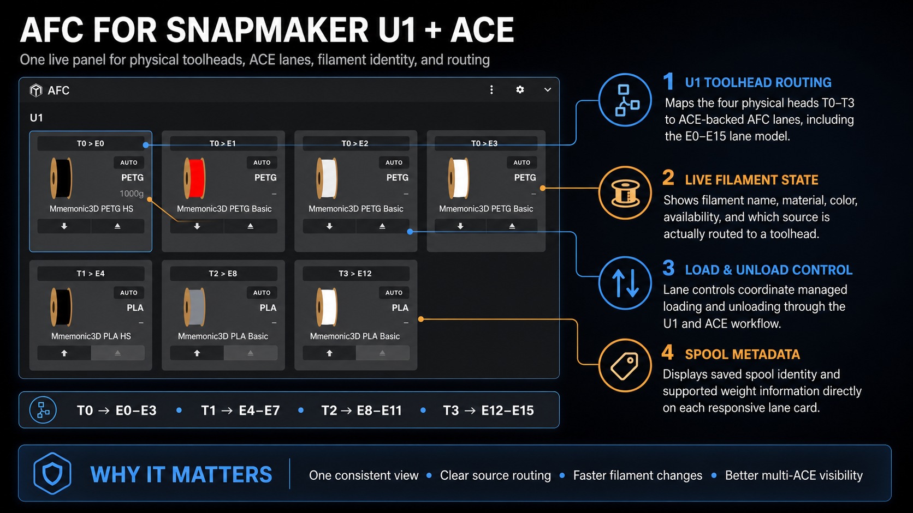
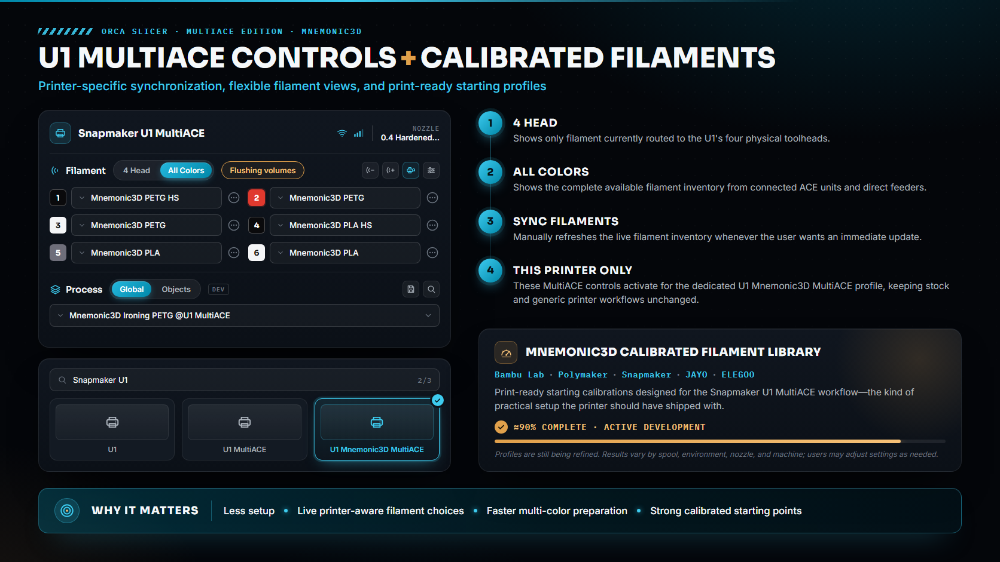

# Features

Orca Slicer - MultiACE Edition by Mnemonic3D adds dedicated Snapmaker U1
MultiACE support directly to OrcaSlicer.

## Feature highlights

### ACE filament management

The U1 filament interface identifies ACE-managed toolheads, supports managed
loading and unloading, and couples filament-detail color changes to the
confirmed ACE auto-swap workflow.

### AFC compatibility for the Snapmaker U1 and ACE

The AFC panel brings U1 physical-toolhead routing, ACE-backed lanes, live
filament state, lane controls, and supported spool metadata into one responsive
view.

### Printer-specific MultiACE controls and calibrated filaments

The dedicated U1 Mnemonic3D MultiACE profile adds 4 Head / All Colors views,
manual filament synchronization, and a growing set of calibrated filament
starting profiles. The calibration library is approximately 90%
complete and remains under active development; users may adjust profiles for
their spool, environment, nozzle, and machine.

> Feature artwork created by Mnemonic3D.

## Patches and fixes

* **Snapmaker U1 MultiACE Support** — Adds native recognition of the U1 as a MultiACE-capable printer.
* **Mnemonic3D MultiACE Machine Profile** — Adds a dedicated custom U1 MultiACE machine separate from stock profiles.
* **0.4 mm Mnemonic3D Printer Preset** — Adds the recommended custom 0.4 mm configuration.
* **Generic Printer Connection Fix** — Removes hardcoded printer IP addresses and uses each user's local printer preset.
* **Snapmaker Printer Agent Patch** — Adds Snapmaker-specific communication and MultiACE device-state handling.
* **MultiACE API Integration** — Reads live toolhead, feeder, ACE, slot, material, and color information from the printer.
* **Physical Head State Fix** — Uses live printer state to determine what filament is actually loaded in each head.
* **Direct Filament Sync** — Imports live MultiACE filament inventory directly into OrcaSlicer.
* **Feeder Filament Support** — Displays manually fed filament only when the corresponding head reports it as loaded.
* **ACE Slot Inventory Support** — Displays available filament from connected ACE units.
* **Available Color Placeholder Fix** — Shows unused ACE colors without falsely reporting them as physically loaded.
* **4 Head View** — Displays only filament currently loaded in the four physical U1 toolheads.
* **All Colors View** — Displays the complete available MultiACE filament inventory.
* **View Mode Persistence** — Remembers the selected 4 Head / All Colors mode after restarting Orca.
* **System Preset Safety Fix** — Prevents generic system profiles from attempting live printer communication.
* **Filament Sync Persistence** — Saves synchronized filament selections so they survive an Orca restart.
* **Variable Filament Count Patch** — Allows more than four logical filament choices while retaining four physical toolheads.
* **Filament Header UI Patch** — Adds native Orca-style 4 Head / All Colors controls.
* **Filament Header Layout Fix** — Centers MultiACE controls and restores Sync Filaments to the right side.
* **Sync Completion Dialog Fix** — Automatically closes the sync confirmation dialog after a short countdown.
* **MultiACE Start G-code Patch** — Updates machine startup G-code for compatibility with PAXX and MultiACE.
* **Native Auto-Feed Conflict Fix** — Removes Snapmaker filament-loading commands that conflict with MultiACE.
* **Hardcoded ACE Swap Removal** — Prevents machine start G-code from assuming a specific ACE, slot, or physical head.
* **MultiACE Filament Change G-code** — Adds logical filament-change handling compatible with MultiACE source mapping.
* **PVA Acceleration Handling** — Applies lower acceleration during PVA tool changes and restores normal acceleration afterward.
* **Physical Heater Target Fix** — Prevents logical MultiACE filament indexes from being treated as physical heater indexes.
* **Orca Temperature Logic Preservation** — Keeps Orca's existing prime-tower and tool-change temperature behavior intact.
* **Web Preflight Compatibility** — Keeps live ACE/head/slot routing inside the MultiACE Web Preflight workflow.
* **Logical-to-Physical Tool Mapping** — Converts logical filament selections into physical T0-T3 heads and ACE slots.
* **T4-T15 Protection** — Prevents logical filament indexes above T3 from being sent as nonexistent physical toolheads.
* **Toolhead Calibration Preservation** — Prevents Orca from overwriting PAXX per-toolhead XYZ calibration offsets.
* **Same-Slot Swap Protection** — Avoids unnecessary unload/reload operations when the requested ACE slot is already loaded.
* **ACE Unload Safety** — Uses staged unloading, filament sensors, and retries before declaring a filament path empty.
* **ACE Load Verification** — Verifies filament loading and flow before considering an ACE load successful.
* **Toolchange Z-Safety Fix** — Ensures safe Z movement occurs around physical head and filament-source changes.
* **Multi-Head Mapping Validation** — Confirms MultiACE correctly maps jobs to the U1's physical T0-T3 heads.
* **Same-Head Multi-Color Support** — Allows several ACE colors to share the same physical toolhead.
* **Mnemonic3D Process Profile** — Adds a process profile specifically tied to the custom MultiACE machine.
* **Local Postprocessor Removal** — Removes dependency on a private Windows postprocessing script.
* **Profile Editing Safety Fix** — Uses targeted profile edits to avoid damaging Orca metadata or hiding profiles.
* **Custom Printer Thumbnail** — Adds dedicated artwork for the Mnemonic3D MultiACE printer.
* **Thumbnail Cache Fix** — Prevents one U1 profile's cached artwork from replacing another profile's thumbnail.
* **Custom Splash Screen** — Adds Mnemonic3D/MultiACE startup branding.
* **Custom Windows Installer Icon** — Adds dedicated MultiACE Edition installer branding.
* **Custom Executable Name** — Identifies the development executable as **Orca Slicer - MultiACE edition.exe**.
* **Distribution Safety Changes** — Removes user-specific network settings and private paths so the build can be distributed cleanly.

---

[Back to the project home page](README.md)
