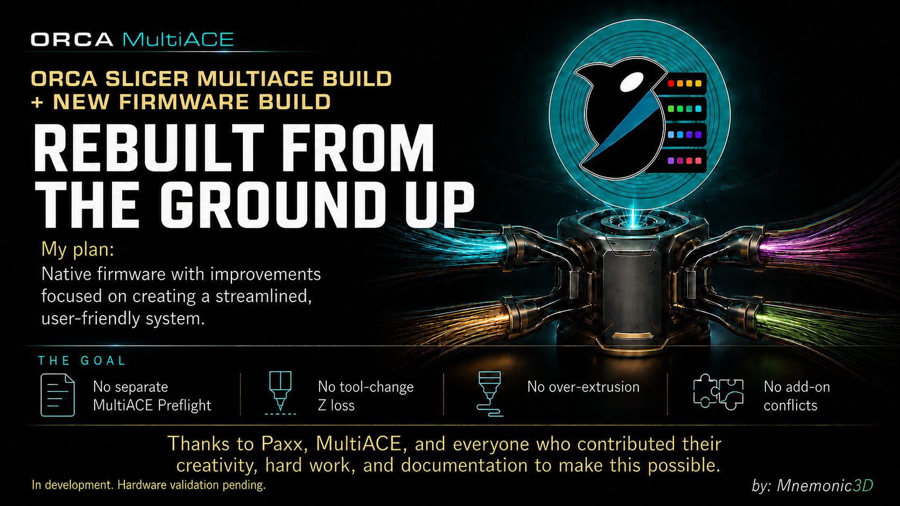

  

<h1 align="center">UPDATE RELEASED — 2026-09-05, 3:06 AM ET</h1>

# Orca Slicer - MultiACE Edition by Mnemonic3D

> **Compatibility Notice**
>
> This project is a **custom, reverse-engineered OrcaSlicer build** created to work with the existing Snapmaker U1, PAXX, and MultiACE firmware ecosystem. It does **not** replace, modify, maintain, or distribute those firmware projects.
>
> **All firmware updates, fixes, releases, and firmware-related support must be obtained through their respective official GitHub repositories.** This project only provides the OrcaSlicer-side integration and compatibility layer.

  
    
  
   
  <strong>Orca Slicer - MultiACE Edition by Mnemonic3D</strong>

## Installation & Troubleshooting

- **[Installation Guide](docs/Installation-Guide.md)** — installing Orca Slicer - MultiACE Edition and the Mandatory Patch, start to finish
- **[Troubleshooting Commons](docs/Troubleshooting-Commons.md)** — something on your printer looking off after a fresh flash? Most of it is expected, documented behavior

---

## Overview

This custom **Orca Slicer MultiACE Edition by Mnemonic3D** adds dedicated Snapmaker U1 MultiACE support directly into OrcaSlicer. It introduces live MultiACE filament synchronization, support for more logical filament choices than the U1's four physical toolheads, **4 Head / All Colors** display modes, custom MultiACE printer and process profiles, MultiACE-aware start and filament-change G-code, and integration with the existing PAXX/MultiACE preflight and tool-mapping workflow.

Additional work includes a Snapmaker-specific printer agent, live ACE slot and toolhead-state handling, filament-state persistence, preservation of PAXX toolhead calibration and swap behavior, custom Mnemonic3D printer artwork, splash screen and Windows installer branding, and removal of the old local postprocessor dependency so the build can be distributed without hardcoded printer addresses or private local scripts.

## Features

See the **[COMPLETE FEATURES PAGE](FEATURES.md)** for the MultiACE integration,
live filament synchronization, logical-to-physical tool mapping, safety fixes,
profiles, interface improvements, and Mnemonic3D branding included in this
edition.

---

## Lineage / credits

Thanks and credit to the developers and contributors whose work made this project possible:

- [OrcaSlicer](https://github.com/OrcaSlicer/OrcaSlicer)
- [PAXX12 Snapmaker U1 Extended Firmware](https://github.com/paxx12-snapmaker-u1/SnapmakerU1-Extended-Firmware)
- [multiACE](https://github.com/decay71/multiACE)
- [SnapACE](https://github.com/BlackFrogKok/SnapAce)

This build is based on and extends their work, bringing these projects together into a more integrated Snapmaker U1 MultiACE workflow.

This repository itself is a standalone (non-fork) publish of [Mnemonic3D/Snapmaker-U1-MultiACE-edition](https://github.com/Mnemonic3D/Snapmaker-U1-MultiACE-edition), pushed here directly rather than as a GitHub fork because of a persistent GitHub fork-network object storage issue that blocked pushes to the fork itself. Full commit history and authorship live at the fork above.

## Acknowledgments

## Development Environment

  
  
  
  

Development on this project also used a **Docker**-based dev container (Ubuntu 24.04, C++ toolchain) via the [devcontainers](https://github.com/devcontainers) "desktop-lite" feature for a reproducible GUI development environment, edited in **Visual Studio Code** with the CMake Tools and C++ Extension Pack extensions, with remote GUI access provided over noVNC.

## Build Tools

  
  
  
  

This build is compiled with **Visual Studio / MSBuild** and **CMake**, the same toolchain used by upstream OrcaSlicer, with **Strawberry Perl** required for building dependencies. The Windows installer for this edition is packaged with **NSIS (Nullsoft Scriptable Install System)**.

  
  
  
  

Development of this build was assisted by AI coding tools — **Claude** (Anthropic) and **ChatGPT** (OpenAI) — used throughout for debugging the MultiACE synchronization logic, refactoring the OrcaSlicer integration code, and drafting project documentation. The G-code handling in this build also owes a debt to the broader open-source firmware community, in particular the **Klipper** project, whose macro system and documentation informed how MultiACE-aware start and filament-change G-code is structured here, and to the wider community of G-code contributors and toolchain authors whose conventions this project builds on.

## License

This project is licensed under the **[GNU Affero General Public License v3.0 (AGPL-3.0)](LICENSE)**.

In plain terms: anyone is free to use, fork, modify, and redistribute this code, including for commercial purposes, as long as they keep it open source under the same license. The one condition that goes beyond a standard GPL license is the "network use" clause — if someone runs a modified version of this software as a service over a network (for example, a hosted build server), they're required to make that modified source code available to the people using the service, not just to people who receive a copy of the binary.

This summary is provided for convenience only and isn't legal advice — the [full license text](LICENSE) is what governs actual use of this project.
