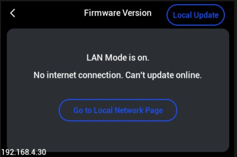
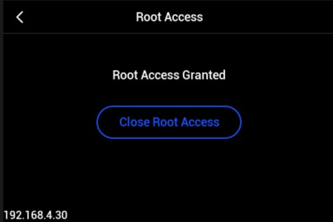
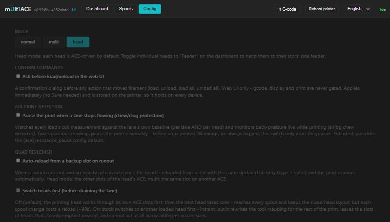
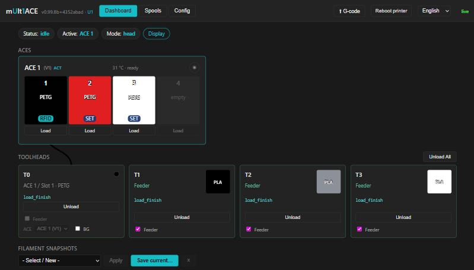

# Installation and Trouble Shooting Commons

Field notes from installing and testing the Mandatory Patch against a
genuinely stock-flashed Snapmaker U1 MultiACE (firmware 0.99.8b). Follow the
install steps in order — most of what looks "broken" afterward is expected,
documented behavior covered in the troubleshooting section below.

> **Physically wiring and setting up your ACE units is out of scope here.**
> For real-time, up-to-date instructions on properly setting up ACEs, see
> [decay71/multiACE](https://github.com/decay71/multiACE).

## Installing Orca Slicer - MultiACE Edition and the Mandatory Patch

1. **Install Orca Slicer - MultiACE Edition**
   - Go to this repository's [Releases page](https://github.com/Mnemonic3D/Snapmaker-U1-Orca-MultiACE-edition/releases) and download the latest Setup installer
   - Run it and complete the installer
   - Launch **Orca Slicer - MultiACE edition**

2. **Flash to genuine stock 0.99.8b**
   - Extract `U1_1.5.2-paxx12-21_multiACE0.99.8b.bin` from the stock firmware zip
   - Copy the `.bin` to the root of a FAT32 USB drive
   - Touchscreen: `Settings > About > Firmware Version > Local Update` → select the file → confirm, let it reboot
   - The patch's file baselines are built against genuine stock 0.99.8b — installing over anything else gets flagged as "locally modified"

   

3. **Enable Root Access**
   - Touchscreen: `Settings > Maintenance > Root Access` → scroll down and Agree → `Open`
   - Credentials: `root` / `snapmaker` (this is what the installer uses over SSH)

   

4. **Open the Mandatory Patch installer and connect**
   - Run `MultiACEPatchesInstaller.exe`
   - Enter the printer's IP address (shown on the touchscreen) and click Connect
   - The IP field is always blank by default

5. **Review and Apply**
   - The installer verifies every file against known stock hashes — a genuinely stock printer should show `OK` across the board
   - Click **Apply Patch**

6. **After "Patch Installed!" — do all three, in order:**
   1. **Full power cycle the printer** — power off completely, wait ~10 seconds, power back on. A soft restart from a menu is not the same thing; most of what was just written only takes effect, and only persists, after a real reboot.
   2. **Reconnect Wi-Fi** if it doesn't reconnect on its own (`Settings > Network`) — the first time Root Access is enabled after a flash, the connection can go stale.
   3. **Set filaments on the printer, and verify the MultiACE Web Preflight page** — every toolhead's confirmed filament source is intentionally cleared on restart (see below), so this needs to be re-checked after every reboot.

## Common Confusions and Fixes

### 1. A toolhead's ACE dropdown shows blank

**Why:** Each toolhead defaults to its own ACE index (head 0 → ACE 0, head 1 → ACE 1, etc.) until something saves a real mapping. A single-ACE printer only has ACE 0, so heads 1–3's dropdowns are bound to an ACE that doesn't physically exist and render blank. Head 0 looks fine purely by coincidence.

**Fix:** Open the ACE dropdown on the affected toolhead and select the only ACE listed (usually `ACE 1`). The mapping saves immediately and survives future reboots.

### 2. Every filament circle shows a gray "?"

**Why:** Right after a fresh flash and install, no toolhead has a known source yet — nothing has been loaded or confirmed since boot. This is the correct empty state.

**Fix:** Load filament into each toolhead you plan to use. The icon fills in the moment a load is confirmed.

### 3. Materials show "/" right after a reboot

**Why:** The touchscreen process starts before Klipper and the ACE unit finish reporting state — a startup race, not a bug.

**Fix:** Wait 10–15 seconds after the home screen first appears. If it's still blank, back out to Home and back in once.

### 4. Dashboard says "Unknown source" even though the touchscreen says Loaded

**Why:** The sensors know filament is physically present (that's what the touchscreen's "Loaded" reflects), but the software record of *which ACE slot fed it* is deliberately dropped on every restart — a fail-closed safety choice, the same philosophy behind reviewed-print-start refusing to trust stale state. The two screens are both telling the truth about different things.

**Fix:**
1. On the Dashboard, click `Load` on the ACE slot that's actually in the toolhead
2. Confirm the pre-selected slot in the dialog (correct it if it's wrong)
3. Click **Unload, then load** — if the slot already matches what's loaded, nothing physically moves; it just re-records the source

### 5. Wi-Fi icon says connected, but it isn't

**Why:** The first time persistent Root Access is enabled after a fresh flash, the Wi-Fi connection can go stale while the status icon keeps reporting the old "connected" state. This is a one-time firmware quirk tied to that first enable.

**Fix:**
1. `Settings > Network` → open the Wi-Fi entry and re-enter the password (or toggle Wi-Fi off/on)
2. If the interface itself is glitching and won't respond, fully power-cycle the printer — not a soft restart

### 6. Verifying everything is actually correct

Open the MultiACE web dashboard:
- Every toolhead you intend to print with should read a real material, not "Unknown source"
- Mode should match your setup (`normal` / `multi` / `head`) — set on the Config page
- ACE routing (the small `ACE` badge) should only appear on toolheads actually fed by an ACE, and only in `multi` or `head` mode — never in `normal` mode

One example of a correctly resolved setup (yours may look different — this printer happens to be in `head` mode with one ACE-routed toolhead and three Feeders, but any mix of ACE-routed and Feeder heads, or `multi` mode entirely, is equally valid): every toolhead shows a real material and source, Feeder heads are checked and show their loaded filament, and each ACE-routed head shows its confirmed slot instead of "Unknown source."

If something still looks wrong after checking against the items above, it's worth reporting as a real issue rather than assuming user error.
